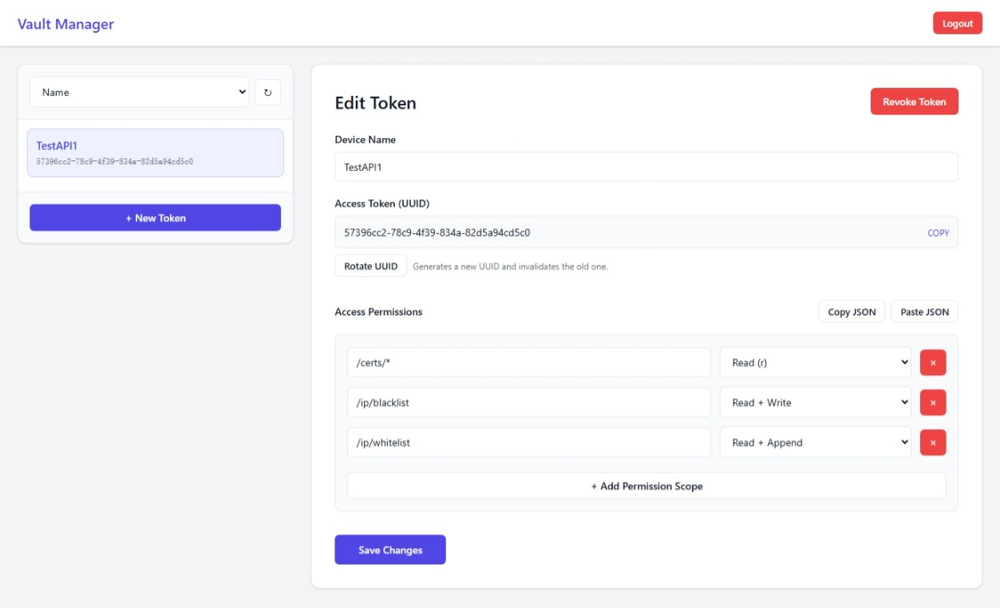

# 🔐 AetherVault

> **Version 1.0.0 (Zephyr)**
>
> A personal lightweight SaaS database with complex permission management, designed for high-performance credential distribution and configuration sharing.



Built on the robust **Cloudflare** ecosystem: **Workers** + **KV** + **D1**.

### [Demo](https://aethervault-service-demo.yigeyigeren.workers.dev/) on Cloudflare

username:admin password:123456

This demo environment (AetherVault Demo) is for feature demonstration and technical exchange purposes only.

Data Disclosure: Since the login credentials are publicly available, please do not upload any data involving personal privacy, production environment keys, or sensitive commercial information. Any data uploaded by any user can be viewed by other visitors.

Data Persistence: Although currently configured to "not automatically delete data," this environment serves as an unstable demo node, and the author reserves the right to clear the database, reset the configuration, or stop the service at any time without prior notice.

---

## ✨ Features

- 🛡️ **Data Security**: UUID-based module-level permission control.
- 💾 **Reliable Storage**: Configuration items persisted in Cloudflare D1.
- 📦 **Batch Operations**: Supports atomic batch read/write operations to reduce network round-trips.
- 🖥️ **Enhanced Frontend**: Includes a Vue-based frontend for token management, complete database viewing (custom separators, Base64 support), and limited editing capabilities.

---

<details>
<summary><h2>🚀 Deployment</h2></summary>

### Prerequisites

- Node.js and npm installed.
- Cloudflare account.
- Wrangler CLI installed (`npm install -g wrangler`).

### Installation Steps

1. **Clone the repository**

   ```bash
   git clone https://github.com/wuyilingwei/Vault.git
   cd Vault
   ```
2. **Configure Wrangler**

   Create a copy of the configuration file:

   ```bash
   cp wrangler.example.toml wrangler.toml
   ```
3. **Create Resources**

   Create the KV namespace for authentication:

   ```bash
   npx wrangler kv namespace create aethervault-access
   ```

   Create the D1 database for data storage:

   ```bash
   npx wrangler d1 create aethervault-service
   ```

   > ⚠️ **Important**: Update your `wrangler.toml` file with the `id` (for KV) and `database_id` (for D1) returned by the commands above.
   >
4. **Configure Admin Access**

   Set the administrator password used for the frontend management interface:

   ```bash
   npx wrangler secret put ADMIN_PASSWORD
   ```

   > ⚠️ **Security Note**: If `ADMIN_PASSWORD` is not set, all admin authorization attempts will be blocked for security.
   >
   > You can optionally configure the username by setting `ADMIN_USERNAME` in `wrangler.toml`. It defaults to `admin` if not specified.
5. **Initialize Database**

   Initialize the D1 database schema using the provided SQL file:

   ```bash
   npx wrangler d1 execute aethervault-service --remote --file=./init.sql
   ```
6. **Deploy**

   Deploy the worker to Cloudflare:

   ```bash
   npx wrangler deploy
   ```

</details>

## 📖 Usage

Once deployed, you can access the frontend at your worker's URL (e.g., `https://aethervault-service.<your-subdomain>.workers.dev`).

Use your configured `ADMIN_USERNAME` (default: `admin`) and `ADMIN_PASSWORD` to log in. The frontend provides:
- **Token Management**: Create and manage access tokens.
- **Database Viewer**: View all data with support for custom separators and Base64 decoding/encoding.
- **Data Editor**: Limited editing functionality for database items.

> ⚠️ **Note**: While the frontend supports data editing and includes compatibility checks, it is **not recommended** to perform large-scale or complex data changes directly through the UI.

<details>
<summary><h3>📚 API Documentation</h3></summary>

**Authentication**

All API requests must include the UUID (Device/App Identifier) in the `Authorization` header using the Bearer scheme:

`Authorization: Bearer <YOUR_UUID_TOKEN>`

**Endpoint**

`POST /api/data`

**Operations**

The API supports batch operations via the `ops` array. Operations are executed **sequentially** in the exact order they appear in the JSON array to prevent data conflicts.

> **Note**: The server does **not** sort operations by `id` or any other field. The execution order is strictly determined by the array index.

Each operation object can contain:

- `id` (optional): Custom identifier to track the operation in the response.
  > **Recommendation**: Use unique IDs that reflect the execution order (e.g., `task_01`, `task_02`) to avoid confusion, although the API does not strictly enforce uniqueness.
- `type` (required): Operation type (`write`, `append`, `read`, `list`).
- `module` (required): Target module name.
- `key` (optional): Target key (required for `write`, `append`, `read`).
- `value` (optional): Data to write or append.
- `separator` (optional): Delimiter definition (only valid for `write` operations).

**Operation Types**

- **write**: Overwrite value (can define separator).
- **append**: Append value using the pre-defined separator.
- **read**: Retrieve a specific key's value.
- **list**: List all keys and values within the specified module (scope).

**Example Request**

```json
{
    "ops": [
        { "id": "req1", "type": "write", "module": "config", "key": "theme", "value": "dark" },
        { "id": "req2", "type": "write", "module": "logs", "key": "access", "value": "init", "separator": "\n" },
        { "id": "req3", "type": "append", "module": "logs", "key": "access", "value": "user_login" },
        { "id": "req4", "type": "read", "module": "config", "key": "theme" },
        { "id": "req5", "type": "list", "module": "config" }
    ]
}
```

**Example Response**

```json
[
    { "id": "req1", "status": 200, "data": { "last_update": "2025-12-23T01:56:56.653Z" } },
    { "id": "req2", "status": 200, "data": { "last_update": "2025-12-23T01:56:58.123Z" } },
    { "id": "req3", "status": 200, "data": { "last_update": "2025-12-23T01:56:59.704Z" } },
    { "id": "req4", "status": 200, "data": { "content": "dark", "last_update": "2025-12-23T01:56:59.704Z" } },
    { "id": "req5", "status": 200, "data": { "items": { "theme": "dark", "lang": "en" } } }
]
```

</details>
